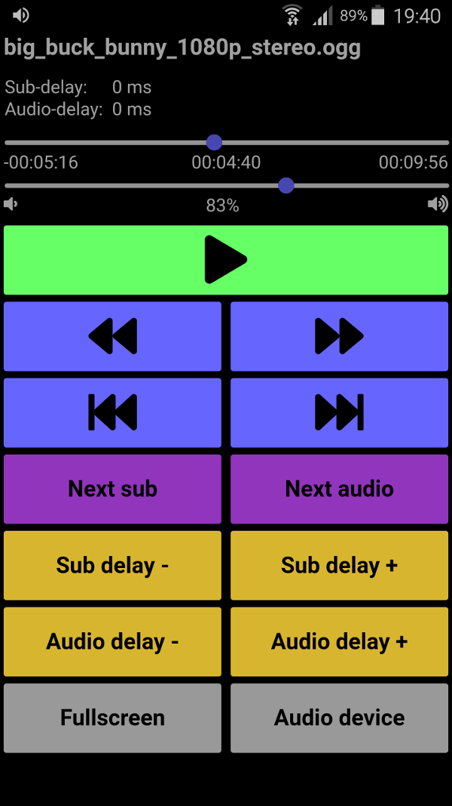
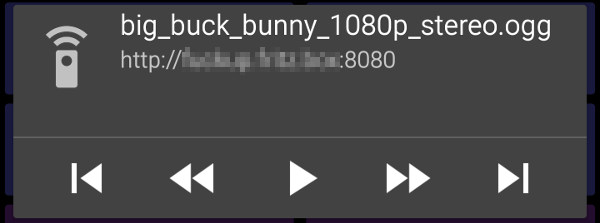

# simple-mpv-webui
...is a web based user interface with controls for the [mpv mediaplayer](https://mpv.io/).

## Usage
To use it, simply copy `webui.lua` and the `webui-page`-folder to `~/.mpv/scripts`, mpv will then run it automatically.

Alternatively you can also use the `--script` option from mpv or add something like `scripts-add=/path/to/simple-mpv-webui/webui.lua` to `mpv.conf`.

By default it serves the webui on port 8080. You can change the port with 
`--script-opts=webui-port=${PORT}`.

## Dependencies
 - [luasocket](https://github.com/diegonehab/luasocket)

## Screenshot

## Media Session API
When using a browser that supports it, simple-mpv-webui uses the Media Session
API to provide a notification with some metadata and controls:

## Thanks
Thanks to [makedin](https://github.com/makedin) for his work on this.

## Differences to mpv-web-ui
 - More controls
 - Some styles and font-awesome
 - Option to set the port being used (defaults to 8080)
 - Using the Media Session API

## Warning
These are my first steps with lua, so I'm just happy it works.
